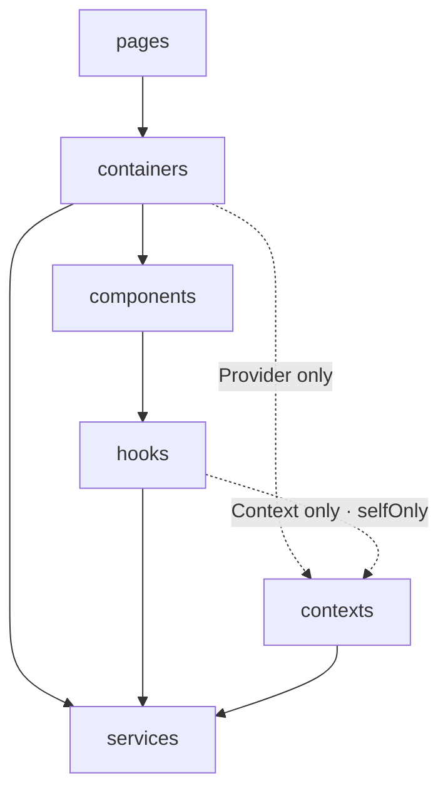

# What `init` Generates

One `blueprint.config.mjs` compiles into four artifacts. This page shows what they
actually look like — taken verbatim from `init` on a fresh Vue project. The rule
everywhere: **edit the blueprint, not the outputs** — every artifact regenerates from
the config, so hand edits are overwritten by design.

## The source: `blueprint.config.mjs`

On a greenfield repo the whole config is one preset call:

```js
import { vuePreset } from '@kekkai/blueprint';

export default vuePreset({ name: 'my-app' });
```

Everything below compiles from it.

## `eslint.config.mjs` — Enforce

The generated flat config is a thin file: the structural rules come from
`emitLint(blueprint)` at lint time, so the config can never drift from the blueprint.
This is also the pattern for merging into an **existing** eslint config — spread
`...emitLint(blueprint)` into your own file, **after** your existing entries
(later entries win in flat config, so this keeps the blueprint's per-layer
tuning alive over broad presets; rules both sides set — `no-restricted-*` —
still merge into ONE entry):

```js
// Generated by @kekkai/blueprint init — regenerated on every init.
// Only this generated file is regenerated (this banner marks it as
// blueprint-owned) — a hand-written eslint config is never overwritten.
// Keep custom entries in your own config and spread ...emitLint(blueprint)
// there instead of editing this file.
import { emitLint } from '@kekkai/blueprint';
import comments from '@eslint-community/eslint-plugin-eslint-comments';
import vueParser from 'vue-eslint-parser';
import blueprint from './blueprint.config.mjs';

export default [
  // Parser setup — needed when THIS file is the live config. Merging into
  // a config that already wires parsers? Skip these blocks.
  {
    files: ['**/*.vue'],
    languageOptions: { parser: vueParser },
  },
  ...emitLint(blueprint),
  {
    files: ['src/**/*.{js,jsx,ts,tsx,vue}'],
    plugins: {
      '@eslint-community/eslint-comments': comments,
    },
    rules: {
      '@eslint-community/eslint-comments/no-unlimited-disable': 'error',
      '@eslint-community/eslint-comments/require-description': 'error',
    },
  },
];
```

What `emitLint` expands to — layer flow, ownership, module entries, the
[embedded plugin rules](/guide/reference#the-embedded-eslint-plugin) — is enumerated
on the reference page.

## `docs/architecture-handbook.md` — Explain

The human handbook: the layer diagram (mermaid), a responsibility table, the module
shape, and the import discipline — all rendered from the same config that drives
lint, so it cannot drift. An excerpt:

````md
## Architecture

Code flows one way: each layer may import only from the layers below it.



### Layers

| Layer | Responsibility | Must not | Owns |
| --- | --- | --- | --- |
| `pages` | Route layout — assembles containers | hold business logic | — |
| `components` | Reusable, presentational UI | call services; touch the router | — |
| `services` | Network primitives | — | `axios`, global `fetch`, global `WebSocket` |
````

The full handbook continues with the seven component-shape axes, the ten principles,
and the working playbook — the [Philosophy](/philosophy/) section of this site is the
canonical description of that content.

## `CLAUDE.md` / `AGENTS.md` — Collaborate

The agent contract is deliberately compact: layer flow and hard gates inline, and
pointers to the handbook (placement judgment) and the packaged operating discipline.
It lives between marker comments, so a hand-written `CLAUDE.md` keeps everything
outside the block across regenerations:

```md
<!-- BLUEPRINT:START -->
## Architecture contract (generated from blueprint)

> Generated by `@kekkai/blueprint` — edit the blueprint, not this block.

- Framework: `vue`. Import alias: `~app`.
- Layer flow: `pages` → `containers` → `components` → `hooks` → `contexts` → `services`
- **Before adding, moving, or renaming any file** — read docs/architecture-handbook.md
- **Operating discipline** — read node_modules/@kekkai/blueprint/agent-contract.md
- Hard gates (machine-enforced): one-way imports, module entries, ownership,
  relative escapes, `maxLines` = 400, `unusedVars`, `cycles`, `usePrefix`, …
- You are the gate for: no undeclared folders under `~app/` (`blueprint inspect` verifies).
<!-- BLUEPRINT:END -->
```

Distribution targets (Cursor, Windsurf, Gemini, Copilot) are configured with
[`emit.agents`](/guide/reference#config-fields-beyond-the-quick-start-example).
