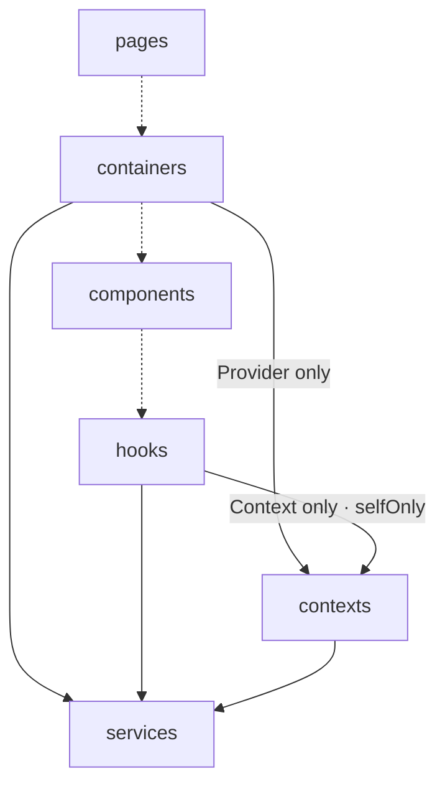

# What `init` Generates

One `blueprint.config.mjs` compiles into four artifacts. This page shows what they
actually look like — taken verbatim from `init` on a fresh Vue project. The rule
everywhere: **edit the blueprint, not the outputs** — every artifact regenerates from
the config, so hand edits are overwritten by design.

## The source: `blueprint.config.mjs`

On a greenfield repo the whole config is one preset call:

```js
import { vuePreset } from '@kekkai/blueprint';

export default vuePreset({ name: 'my-app' });
```

Everything below compiles from it.

## `eslint.config.mjs` — Enforce

The generated flat config is a thin file: the structural rules come from
`emitLint(blueprint)` at lint time, so the config can never drift from the blueprint.
This is also the pattern for merging into an **existing** eslint config — spread
`...emitLint(blueprint)` into your own file, **after** your existing entries
(later entries win in flat config, so this keeps the blueprint's per-layer
tuning alive over broad presets; rules both sides set — `no-restricted-*` —
still merge into ONE entry):

```js
// Generated by @kekkai/blueprint init — regenerated on every init.
// Only this generated file is regenerated (this banner marks it as
// blueprint-owned) — a hand-written eslint config is never overwritten.
// Keep custom entries in your own config and spread ...emitLint(blueprint)
// there instead of editing this file.
import { emitLint } from '@kekkai/blueprint';
import comments from '@eslint-community/eslint-plugin-eslint-comments';
import stylistic from '@stylistic/eslint-plugin';
import imports from 'eslint-plugin-import-x';
import vueParser from 'vue-eslint-parser';
import blueprint from './blueprint.config.mjs';

export default [
  // Parser setup — needed when THIS file is the live config. Merging
  // into an existing config that already wires parsers? Skip these
  // blocks — copying them re-parses files your config already handles.
  // A skipped block leaves its parser package installed: leave it — a
  // later init treats it as required for the stack and re-installs it.
  {
    files: ['**/*.vue'],
    languageOptions: { parser: vueParser },
  },
  ...emitLint(blueprint, { stylistic, imports }),
  // The anti-bypass guard — NOT part of emitLint. A silent, unexplained
  // eslint-disable is exactly how an agent routes around every rule
  // above, so these two rules force each disable to carry a scope and a
  // -- reason. Default: ADOPT. On a brownfield config, annotate the
  // existing bare disables (or ledger them via --suppress-all) rather
  // than dropping the block; dropping is the exception — only when the
  // team already owns a disable discipline, and say so in the report.
  // Its plugin (@eslint-community/eslint-plugin-eslint-comments) is
  // installed by init on every path; dropping the block? Remove that
  // dependency with it. When merging, its position relative to the
  // emitLint spread does not matter — the rule sets never intersect.
  // Scope: JS/TS disable comments only — Vue template <!-- eslint-disable -->
  // directives are not gated by these rules.
  {
    files: ['src/**/*.{js,ts,vue}'],
    plugins: {
      '@eslint-community/eslint-comments': comments,
    },
    rules: {
      '@eslint-community/eslint-comments/no-unlimited-disable': 'error',
      '@eslint-community/eslint-comments/require-description': 'error',
    },
  },
];
```

`stylistic` and `imports` are **arguments**, not library dependencies: blueprint has
none, so a gate whose plugin is missing emits nothing while lint stays green. Which
plugin each gate rides, and what `emitLint` expands to — layer flow, ownership, unit
entries, the [embedded plugin rules](/guide/reference#the-embedded-eslint-plugin) — is
enumerated on the reference page.

The sample's `src/**/*` scope comes from the default `architecture.sourceRoot`, not a
fixed path in the generator. A configured root replaces `src` everywhere in this file;
with `sourceRoot: '.'`, the generated scopes start at the project root.

## `docs/architecture-handbook.md` — Explain

The human handbook: the layer diagram (mermaid), a responsibility table, the unit
shape, and the import discipline — all rendered from the same config that drives
lint, so it cannot drift. An excerpt:

````md
## Architecture

Code flows one way: each layer may import only from the layers below it. Upstream imports and same-layer imports through the alias are barred. `architecture.alias` is the sole canonical cross-boundary spelling; statically resolvable dynamic imports receive the same verdicts.


```mermaid
flowchart TD
  pages -.-> containers
  containers -.-> components
  components -.-> hooks
  containers -->|Provider only| contexts
  hooks -->|Context only · selfOnly| contexts
  containers --> services
  hooks --> services
  contexts --> services
```

> **How to read the diagram**: a **solid** edge is a declared importer relation (its label carries the description and/or `selfOnly` — depend on it, never re-export it). A **dotted** edge only records declaration order: adjacent layers are not necessarily related. Reachability is transitive — a layer may import **any** layer below it in the flow, whether or not an edge is drawn, unless the target narrows its importers (`allowedImporters`).

### Layers

| Layer | Responsibility | Must not | Owns |
| --- | --- | --- | --- |
| `pages` | Route layout — assembles containers; owns routing and SEO concerns. | hold business logic; stack components directly | — |
| `components` | Reusable, presentational UI. | call services; touch the router; own app state | — |
| `services` | Network primitives — the only layer that talks to the HTTP client or sockets. | — | `axios`, global `fetch`, global `WebSocket` |
````

The layer rows are trimmed here; the diagram and the legend are the whole of
that section. **A drawn edge is not the flow** — that is the one thing to read
carefully, because the intuition runs the other way: reachability is the layer order,
and an edge is only drawn where a layer *narrowed* who may import it.

The full handbook continues with the component-shape axes, the core principles,
and the working playbook — the [Philosophy](/philosophy/) section of this site is the
canonical description of that content.

## `CLAUDE.md` / `AGENTS.md` — Collaborate

The agent contract is deliberately compact: layer flow and hard gates inline, and
pointers to the handbook (placement judgment) and the packaged operating discipline.
It lives between marker comments, so a hand-written `CLAUDE.md` keeps everything
outside the block across regenerations:

```md
<!-- BLUEPRINT:START -->
## Architecture contract (generated from blueprint)

> Generated by `@kekkai/blueprint` — edit the blueprint, not this block.
> Your own notes belong OUTSIDE the markers; init rewrites only between them.
> The strictness is the product — it keeps AI development inside the declared
> architecture. Never soften or bypass; disagreements go to the maintainer.

- Framework: `vue`. Canonical source-root alias: `~app`.
- Layer flow: `pages` → `containers` → `components` → `hooks` → `contexts` → `services` — transitive: a layer may import **any** layer after it, unless the target narrows its importers.
- **Before adding, moving, or renaming any file** — placement, unit shapes, ownership, naming, component-shape axes, behavioral principles, the working playbook: read [docs/architecture-handbook.md](docs/architecture-handbook.md) (generated from the same blueprint — always current).
- **Operating discipline** — how to follow the flow, react to lint failures, and the pre-commit checklist: read [node_modules/@kekkai/blueprint/agent-contract.md](node_modules/@kekkai/blueprint/agent-contract.md) (ships inside the package — present once dependencies are installed, always matching the installed version).
- Hard gates (machine-enforced on the files the architecture globs match — a declared position holding no code has nothing failing yet, which is runway, not protection): canonical cross-boundary imports, one-way imports, unit entries, ownership, relative escapes, `maxLines` = 400, `unusedVars`, `codeStyle`, `statementsPerLine`, `statementPadding`, `importBlock`, `fixtureImports`, `usePrefix`, `testFilename`, `deepWatch` fail the project's lint run; statically resolvable dynamic imports receive the same structural checks; `cycles` is diagnosed only when `npx blueprint inspect --baseline` runs; the baseline grandfathers recorded findings, so this is not continuous edit-time prevention and a green lint says nothing about it. Runtime-dependent dynamic targets remain an explicit analysis limitation. When lint fails, fix the structure — never `eslint-disable`, never relocate the violation to a sibling.
- You are the gate for: no undeclared architectural folders under `~app/` (`blueprint inspect --baseline` verifies — red only on what you introduced). Move code into the declared Layer → Unit topology. If the architecture has genuinely outgrown this config, that is the owner's decision — say so and stop; never expand it yourself.
<!-- BLUEPRINT:END -->
```

Four things in there are not decoration. **No runner is named** — "the project's lint
run", because a contract generated from your blueprint alone cannot see whether your
repo uses npm or pnpm. **`cycles` is an on-demand or CI diagnosis from
`blueprint inspect`**, not a continuous lint check. `--baseline` grandfathers recorded
cycle findings and fails only on new ones, so a green lint is not read as covering it.
**Each hard gate states how far it
reaches** — only the files the architecture globs match, which is why a freshly scaffolded repo
with empty declared positions has nothing that can fail yet. And **which gates appear depends on the
stack** — the sample above is a JS project, so `explicitAny` is absent from its list, and
a TypeScript project's contract names it; a gate is listed hard only where the tooling
can actually enforce it.

Distribution targets (Cursor, Windsurf, Gemini, Copilot) are configured with
[`emit.agents`](/guide/reference#config-fields-beyond-the-quick-start-example).

To reject cycles on every lint run, opt in through the import plugin that the generated
config already imports. Add this entry after `...emitLint(...)`:

```js
{
  plugins: { 'import-x': imports },
  rules: { 'import-x/no-cycle': 'error' },
}
```

This is deliberately not the default: the rule re-walks the dependency graph per file
and was measured at 92 seconds on an 850-file repository. Use it when continuous
prevention is worth that lint cost; otherwise run `blueprint inspect --baseline` in CI.
