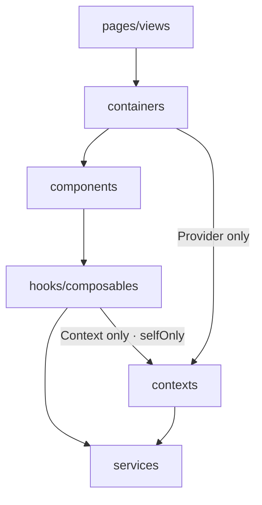

# Layer Architecture

> **In blueprint**: this page documents the presets' `architecture` block — the one part
> of the philosophy that compiles into **hard gates**, not just prose: the
> [generated ESLint config](/guide/generated-artifacts#eslint-config-mjs-—-enforce) and
> [inspect's findings](/guide/reference#what-inspect-reports). Declare your own layers in
> [`blueprint.config.mjs`](/guide/getting-started#the-blueprint) and the same machinery
> enforces them.

**One-way dependency flow + single responsibility per layer.** The principles are
framework-neutral — Vue and React hold the same shapes; a unit just goes by two names.



## Why one-way

1. Each layer keeps a single responsibility (a hook that never imports a component stays
   reusable logic)
2. Ownership is visible at a glance — no repo-wide grep
3. Refactors are safe: moving a file across layers makes lint flag every illegal call site
4. Adding a dependency edge means editing the blueprint — "should this layer really
   depend on that one?" surfaces in review

## The layers

**This is the `flat` preset's list**, and it is one of two. Under
[`structure: 'modular'`](/guide/structure) the same presets ship
`components` → `hooks` → `contexts` → `services` and nothing else: `pages` and
`containers` are *deleted*, not renamed — routing moves into the `app` module, and
what assembled a feature is now the module's own root, which is the implicit top
layer rather than a name in this list. Everything below still holds inside each
module; only the outermost two entries dissolve.

**`pages`**

- Does — page layout, assembling containers; routes, SEO
- Must not — hold business logic, stack components directly

**`containers`**

- Does — one feature: assembly, business logic, CRUD; stateful, calls services, drives navigation

**`components`**

- Does — reusable, presentational UI; may call hooks
- Must not — touch the router, call services, own app state

**`hooks`**

- Does — `inject`/`useContext` live only here; adapts server/shared state; **stores (Pinia/Zustand) are private objects of this layer**
- Must not — expose a raw store

**`contexts`**

- Does — `provide`/`createContext` live only here; exposes Context/Provider

**`services`**

- Does — network primitives; the only importer of `axios`, the only caller of `fetch`/`WebSocket`
- Must not — contain UI or business logic

**There is no `stores` layer and no `utils` layer.** A store has a single owner hook —
its public face; other features read through that hook. And `utils/` is a cohesion-free
junk drawer that grows without bound until everything imports it — pure functions get
homes by ownership instead: module-private files, or a named, domain-scoped module.

## Ownership — `owns`

The "only importer of `axios`" cells above are not prose — they compile. A layer
declares the primitives it exclusively owns, and every other layer is barred from them:

```js
{ name: 'services', owns: ['axios', { global: 'fetch' }, { global: 'WebSocket' }] },
{ name: 'hooks',    owns: [{ package: 'vue', imports: ['inject'] }, 'pinia'] },
```

- a bare string owns a **whole package**; `{ package, imports }` narrows it to specific
  named imports (`vue` stays importable everywhere — only `inject` is fenced)
- `{ global }` owns a **global** (`fetch`, `WebSocket`) — no import statement exists,
  so this half is enforced by lint (`no-restricted-globals`), not `inspect`
- package ownership lands twice: lint (`no-restricted-imports`) and inspect's
  [`package-ownership` finding](/guide/reference#what-inspect-reports)
- under [`modules`](/guide/structure) a **module** owns primitives the same way, one
  level up: a layer's `owns` bars every other layer, a module's bars every other
  module, and the finding names the level it means

## Feature folder — one module, one folder

```
components/
└─ Dropdown/
   ├─ index        ← the only public entry
   ├─ Dropdown     ← implementation, named after the module (never "Component")
   ├─ hooks        ← private
   ├─ styles       ← private
   └─ types        ← private
```

This shape is declared per layer as [`layout: 'folder'`](/guide/reference#config-fields-beyond-the-quick-start-example)
(`file` — one file per unit — is what omitting it means), and under
[`modules`](/guide/structure) the same shape repeats one level up: a module is a
folder behind its own `index` too.

- `index` is the module's _face_ — the outside world knows nothing else
- Private sub-components live inside (a container's `ProfileTab`); promotion to
  `components/` happens **when sharing actually arrives**, not speculatively
- The implementation file carries the module's name — a tab bar of ten `Component.tsx`
  is unnavigable

`components` vs `containers` in one question: **"would it survive a feature swap?"**
Reusable and data-blind → component. Bound to this feature's data, flow, CRUD →
container. Containers wire components to data; components know nothing about containers.
