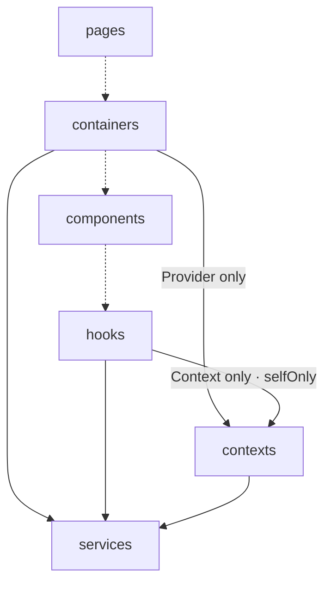

## Architecture

Code flows one way: each layer may import only from the layers below it. Upstream imports and same-layer imports through the alias are barred.

> **How to read the diagram**: a **solid** edge is a declared importer relation (its label carries the description and/or `selfOnly` — depend on it, never re-export it). A **dotted** edge only records declaration order: adjacent layers are not necessarily related. Reachability is transitive — a layer may import **any** layer below it in the flow, whether or not an edge is drawn, unless the target narrows its importers (`allowedImporters`).

### Layers

| Layer | Responsibility | Must not | Owns |
| --- | --- | --- | --- |
| `pages` | Route layout — assembles containers; owns routing and SEO concerns. | hold business logic; stack components directly | — |
| `containers` | A feature: assembles components, owns local state, calls services, drives navigation. | — | — |
| `components` | Reusable, presentational UI. | call services; touch the router; own app state | — |
| `hooks` | Adapts server and shared state; the only layer that injects context or owns a store. | — | `vue` → `inject`, `pinia` |
| `contexts` | Defines and provides Context / Provider only. | — | `vue` → `provide` |
| `services` | Network primitives — the only layer that talks to the HTTP client or sockets. | — | `axios`, global `fetch`, global `WebSocket` |
