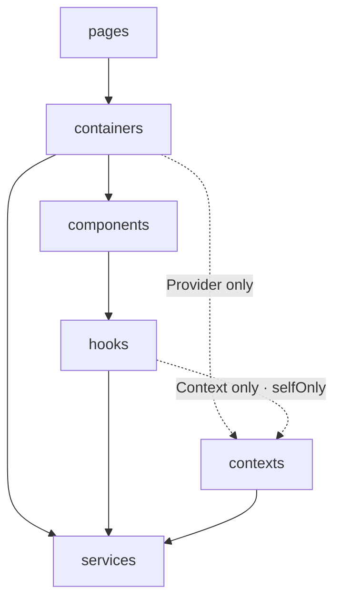

# `init` 的產出物

一份 `blueprint.config.mjs` 轉譯出四種產出物。本頁列出它們的實際樣貌 —— 內容取自在全新 Vue 專案上執行 `init` 的逐字結果。通則只有一條：**改 blueprint config，不要改產出物** —— 所有產出物都由 config 重新生成，手動編輯的內容在設計上就會被蓋掉。

## 來源：`blueprint.config.mjs`

全新專案的 config 即為一次預設藍圖呼叫：

```js
import { vuePreset } from '@kekkai/blueprint';

export default vuePreset({ name: 'my-app' });
```

以下所有內容都由這份 config 轉譯而來。

## `eslint.config.mjs` —— 強制

生成的 lint config 刻意保持精簡：結構規則在跑 lint 時由 `emitLint(blueprint)` 展開，所以 config 永遠不會跟 blueprint 脫節。這同時也是併入**既有** ESLint config 的作法 —— 在自己的 config 檔展開 `...emitLint(blueprint)` 就好：

```js
// Generated by @kekkai/blueprint init — regenerated on every init.
// Only this generated file is regenerated (this banner marks it as
// blueprint-owned) — a hand-written eslint config is never overwritten.
// Keep custom entries in your own config and spread ...emitLint(blueprint)
// there instead of editing this file.
import { emitLint } from '@kekkai/blueprint';
import comments from '@eslint-community/eslint-plugin-eslint-comments';
import vueParser from 'vue-eslint-parser';
import blueprint from './blueprint.config.mjs';

export default [
  {
    files: ['**/*.vue'],
    languageOptions: { parser: vueParser },
  },
  ...emitLint(blueprint),
  {
    files: ['src/**/*.{js,jsx,ts,tsx,vue}'],
    plugins: {
      '@eslint-community/eslint-comments': comments,
    },
    rules: {
      '@eslint-community/eslint-comments/no-unlimited-disable': 'error',
      '@eslint-community/eslint-comments/require-description': 'error',
    },
  },
];
```

`emitLint` 展開的內容 —— 分層流向、套件所有權、模組入口、[內嵌 plugin 規則](/zh-TW/guide/reference#內嵌-eslint-外掛) —— 總表頁有完整清單。

## `docs/architecture-handbook.md` —— 說明

給人閱讀的架構手冊：分層圖（mermaid）、職責表、模組形狀與匯入紀律 —— 跟 lint 規則出自同一份 config，所以不會彼此脫節。節錄如下：

````md
## Architecture

Code flows one way: each layer may import only from the layers below it.



### Layers

| Layer | Responsibility | Must not | Owns |
| --- | --- | --- | --- |
| `pages` | Route layout — assembles containers | hold business logic | — |
| `components` | Reusable, presentational UI | call services; touch the router | — |
| `services` | Network primitives | — | `axios`, global `fetch`, global `WebSocket` |
````

完整手冊還有七條元件形狀軸線、十條核心信念與作業守則 —— 這些內容的正典版本就是本站的[工程理念](/zh-TW/philosophy/)章節。

## `CLAUDE.md` / `AGENTS.md` —— 協作

AI Agent 守則刻意保持精簡：分層流向與硬性關卡直接內嵌，放置判斷指向手冊、作業紀律指向套件內附的守則文件。守則放在標記註解之間，所以手寫的 `CLAUDE.md` 在重新生成時，區塊以外的內容一律保留：

```md
<!-- BLUEPRINT:START -->
## Architecture contract (generated from blueprint)

> Generated by `@kekkai/blueprint` — edit the blueprint, not this block.

- Framework: `vue`. Import alias: `~app`.
- Layer flow: `pages` → `containers` → `components` → `hooks` → `contexts` → `services`
- **Before adding, moving, or renaming any file** — read docs/architecture-handbook.md
- **Operating discipline** — read node_modules/@kekkai/blueprint/agent-contract.md
- Hard gates (machine-enforced): one-way imports, module entries, ownership,
  relative escapes, `maxLines` = 400, `unusedVars`, `cycles`, `usePrefix`, …
- You are the gate for: no undeclared folders under `~app/` (`blueprint inspect` verifies).
<!-- BLUEPRINT:END -->
```

發佈目標（Cursor、Windsurf、Gemini、Copilot）由 [`emit.agents`](/zh-TW/guide/reference#快速上手範例以外的-config-欄位) 設定。

## `.github/workflows/blueprint-ci.yml` —— 檢核

lint 加上唯讀架構報告，從第一個 commit 起生效：

```yaml
name: my-app · Blueprint CI

on:
  push:
    branches: [main]
  pull_request:

jobs:
  architecture:
    runs-on: ubuntu-latest
    steps:
      - uses: actions/checkout@v4
      - uses: actions/setup-node@v4
        with:
          node-version: 22
      - run: npm install
      - run: npx eslint src
      - run: npx blueprint inspect
```

既有專案把最後一步換成 `npx blueprint inspect --baseline` 就好 —— 也就是 [baseline 棘輪](/zh-TW/guide/getting-started#既有專案-——-blueprint-inspect)。
