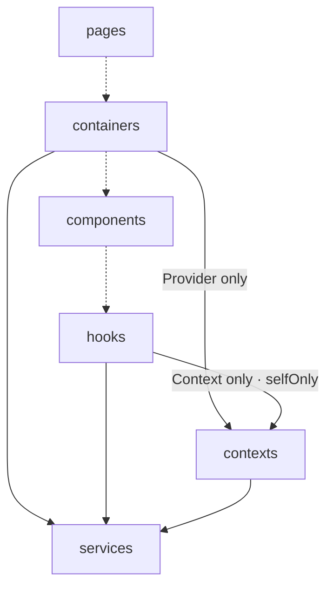

# `init` 產出結果

一份 `blueprint.config.mjs` 轉譯出四種產出結果。<br>
本頁列出它們的實際樣貌 —— 內容取自在全新 Vue 專案上執行 `init` 的實際產出。<br>
為了好讀，範例裡的**說明文字已翻成中文**；識別碼、規則名、套件名與檔名保留原文，跟你在磁碟上看到的一致（想看原文全貌請看 [en 版](/guide/generated-artifacts)）。<br>
通則只有一條：**改 blueprint config，不要改產出結果** —— 所有產出結果都由 config 重新生成，手動編輯的內容在設計上就會被蓋掉。

## 來源：`blueprint.config.mjs`

全新專案的 config 即為一次 preset 呼叫：

```js
import { vuePreset } from '@kekkai/blueprint';

export default vuePreset({ name: 'my-app' });
```

以下所有內容都由這份 config 轉譯而來。

## `eslint.config.mjs` —— 強制

生成的 lint config 刻意保持精簡：結構規則在跑 lint 時由 `emitLint(blueprint)` 展開，所以 config 永遠不會跟 blueprint 脫節。<br>
這同時也是併入**既有** ESLint config 的作法 —— 在自己的 config 檔展開 `...emitLint(blueprint)`，而且要放在**既有 entry 之後**（flat config 後者為王，這樣 blueprint 的逐層調校才不會被泛用 preset 蓋掉；兩邊都設的規則 —— `no-restricted-*` —— 仍要合併成同一個 entry）：

```js
// 由 @kekkai/blueprint init 生成 —— 每次 init 都會重新生成。
// 只有這個生成的檔案會被重新生成（第一行這段 banner 就是「blueprint
// 持有」的標記）—— 手寫的 eslint config 一律不覆蓋。
// 客製化的 entry 請留在你自己的 config 檔，並在那裡展開
// ...emitLint(blueprint)，不要改這個檔案。
import { emitLint } from '@kekkai/blueprint';
import comments from '@eslint-community/eslint-plugin-eslint-comments';
import stylistic from '@stylistic/eslint-plugin';
import imports from 'eslint-plugin-import-x';
import vueParser from 'vue-eslint-parser';
import blueprint from './blueprint.config.mjs';

export default [
  // Parser 設定 —— 只有在「這個檔案就是實際生效的 config」時才需要。
  // 要併進已經接好 parser 的既有 config？跳過這幾個 block ——
  // 照抄會讓你的 config 已經處理過的檔案再被解析一次。
  // 跳過的 block 會留下它的 parser 套件：留著就好 —— 之後的 init
  // 仍然會判定這個技術棧需要它，並重新安裝。
  {
    files: ['**/*.vue'],
    languageOptions: { parser: vueParser },
  },
  ...emitLint(blueprint, { stylistic, imports }),
  // 反繞道護欄 —— 這段「不屬於」emitLint。一個安靜、沒說明的
  // eslint-disable，正是 Agent 繞過上面每一條規則的方式，所以這兩條
  // 規則強制每個 disable 都要帶上作用範圍與 -- 理由。預設立場：採用。
  // 在既有專案的 config 上，請把現存的裸 disable 補上說明（或用
  // --suppress-all 記進帳本），而不是把這段拿掉；拿掉是例外 —— 只有在
  // 團隊本來就有自己的 disable 紀律時才這麼做，而且要在報告裡說明。
  // 它的外掛（@eslint-community/eslint-plugin-eslint-comments）在每一
  // 條路徑的 init 都會安裝；決定拿掉這段？那個依賴也一起移除。合併時，
  // 這段放在 emitLint 展開的前面或後面都沒差 —— 兩邊的規則集合不相交。
  // 作用範圍：只管 JS/TS 的 disable 註解 —— Vue template 裡的
  // <!-- eslint-disable --> 指示詞不受這兩條規則管轄。
  {
    files: ['src/**/*.{js,ts,vue}'],
    plugins: {
      '@eslint-community/eslint-comments': comments,
    },
    rules: {
      '@eslint-community/eslint-comments/no-unlimited-disable': 'error',
      '@eslint-community/eslint-comments/require-description': 'error',
    },
  },
];
```

`stylistic` 跟 `imports` 是**參數**，不是套件的依賴：blueprint 一個依賴都沒有，<br>
所以外掛缺席的關卡會完全不 emit，而 lint 照樣是綠的。<br>
哪個關卡靠哪個外掛，以及 `emitLint` 展開的內容 —— 分層流向、套件所有權、資料夾入口、[內嵌 plugin 規則](/zh-TW/guide/reference#內嵌-eslint-外掛) —— 總表頁有完整清單。

## `docs/architecture-handbook.md` —— 說明

給人閱讀的架構手冊：分層圖（mermaid）、職責表、資料夾形狀與匯入紀律 ——<br>
跟 lint 規則出自同一份 config，所以不會彼此脫節。節錄如下：

````md
## 架構

Code 單向流動：每一層只能匯入排在它後面的層。反向匯入與同層匯入一律禁止。


```mermaid
flowchart TD
  pages -.-> containers
  containers -.-> components
  components -.-> hooks
  containers -->|Provider only| contexts
  hooks -->|Context only · selfOnly| contexts
  containers --> services
  hooks --> services
  contexts --> services
```

> **這張圖怎麼看**：**實線**是一條宣告出來的匯入者關係（標籤帶著描述與／或 `selfOnly` —— 可以依賴它，但永遠不能再匯出）。**虛線**只記錄宣告順序：相鄰的兩層不一定有關係。可達性具遞移性 —— 一層可以匯入流向上排在它後面的**任何**一層，不管圖上有沒有畫線，除非目標那層收窄了自己的匯入者（`allowedImporters`）。

### 分層

| 分層 | 職責 | 不可以 | 專屬持有 |
| --- | --- | --- | --- |
| `pages` | 路由版面 —— 組裝 containers；掌管路由與 SEO 相關的事。 | 放商業邏輯；直接堆 components | — |
| `components` | 可重用的展示型 UI。 | 呼叫 services；碰 router；持有應用程式狀態 | — |
| `services` | 網路存取原語 —— 唯一會跟 HTTP client 或 socket 說話的一層。 | — | `axios`、全域 `fetch`、全域 `WebSocket` |
````

上面的分層列是節錄；圖與圖例則是那一節的全部。<br>
**畫出來的線不等於流向** —— 這是唯一要看仔細的地方，因為直覺剛好相反：<br>
可達性看的是分層順序，而線只有在某一層**收窄了誰可以匯入它**時才會畫出來。

完整手冊還有元件設計軸線、核心信念與作業守則 ——<br>
這些內容的正典版本就是本站的[工程理念](/zh-TW/philosophy/)章節。

## `CLAUDE.md` / `AGENTS.md` —— 協作

AI Agent 守則刻意保持精簡：分層流向與硬性關卡直接內嵌，放置判斷指向手冊、作業紀律指向套件內附的守則文件。<br>
守則放在標記註解之間，所以手寫的 `CLAUDE.md` 在重新生成時，區塊以外的內容一律保留：

```md
<!-- BLUEPRINT:START -->
## 架構守則（由 blueprint 生成）

> 由 `@kekkai/blueprint` 生成 —— 要改請改 blueprint config，不要改這個區塊。
> 你自己的筆記請放在標記「之外」；init 只會重寫標記之間的內容。
> 嚴格本身就是產品 —— 它讓 AI 開發待在宣告好的架構裡面。
> 永遠不要放寬或繞過；有異議請找維護者。

- 框架：`vue`。匯入別名：`~app`。
- 分層流向：`pages` → `containers` → `components` → `hooks` → `contexts` → `services` —— 具遞移性：一層可以匯入排在它後面的**任何**一層，除非目標那層收窄了自己的匯入者。
- **新增、搬移或重新命名任何檔案之前** —— 放在哪裡、資料夾形狀、專屬持有、命名、元件設計軸線、行為準則、作業守則：讀 [docs/architecture-handbook.md](docs/architecture-handbook.md)（由同一份 blueprint 生成 —— 永遠是最新的）。
- **作業紀律** —— 怎麼順著流向走、lint 失敗時怎麼反應、commit 前的檢查清單：讀 [node_modules/@kekkai/blueprint/agent-contract.md](node_modules/@kekkai/blueprint/agent-contract.md)（隨套件一起出貨 —— 裝好依賴就會在，而且永遠對得上安裝的版本）。
- 硬性關卡（由機器強制，作用範圍是 layer glob 打到的檔案 —— 一層還沒有 code 就沒有東西會失敗，那是跑道，不是保護）：單向匯入、資料夾入口、專屬持有、相對路徑逃逸、`maxLines` = 400、`unusedVars`、`explicitAny`、`codeStyle`、`statementsPerLine`、`statementPadding`、`importBlock`、`fixtureImports`、`usePrefix`、`testFilename`、`deepWatch` 會讓專案的 lint 失敗；`cycles` 改由 `npx blueprint inspect --baseline` 把關，所以綠燈的 lint 對它什麼都沒說。lint 失敗時，去修結構 —— 永遠不要 `eslint-disable`，也不要把違規搬到隔壁檔案。
- 由你把關的部分：`~app/` 底下不得有未宣告的資料夾（`blueprint inspect --baseline` 會驗 —— 只對你新引入的東西變紅）。它的檢測項目會給兩個解法，而只有一個是你的：把 code 搬進既有分層的某個資料夾。如果架構真的長超過這份 config 了，那是擁有者的決定 —— 講出來然後停手；永遠不要自己宣告新的分層。
<!-- BLUEPRINT:END -->
```

裡面有三件事不是裝飾用的。<br>
**不指名執行器** —— 寫的是「專案的 lint」（原文 the project's lint run），因為只從 blueprint config 生成的守則，看不到你的 repo 用 npm 還是 pnpm。<br>
**`cycles` 歸給 `blueprint inspect`**，不是 lint，所以綠燈的 lint 不會被讀成「循環依賴也顧到了」。<br>
**每條硬性關卡都寫出自己的作用範圍** —— 只管 layer glob 打到的檔案，這也是為什麼剛建好、分層還空著的專案沒有東西會失敗。

發佈目標（Cursor、Windsurf、Gemini、Copilot）由 [`emit.agents`](/zh-TW/guide/reference#快速上手範例以外的-config-欄位) 設定。
