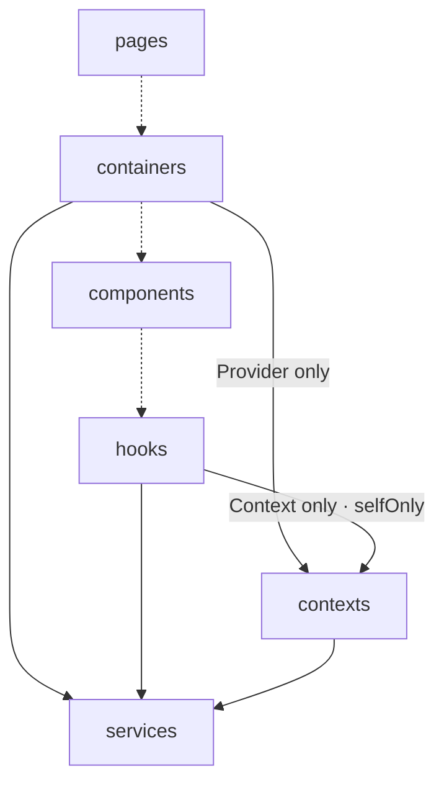

# `init` 產出結果

一份 `blueprint.config.mjs` 轉譯出四種產出結果。<br>
本頁列出它們的實際樣貌 —— 內容取自在全新 Vue 專案上執行 `init` 的逐字結果。<br>
通則只有一條：**改 blueprint config，不要改產出結果** —— 所有產出結果都由 config 重新生成，手動編輯的內容在設計上就會被蓋掉。

## 來源：`blueprint.config.mjs`

全新專案的 config 即為一次 preset 呼叫：

```js
import { vuePreset } from '@kekkai/blueprint';

export default vuePreset({ name: 'my-app' });
```

以下所有內容都由這份 config 轉譯而來。

## `eslint.config.mjs` —— 強制

生成的 lint config 刻意保持精簡：結構規則在跑 lint 時由 `emitLint(blueprint)` 展開，所以 config 永遠不會跟 blueprint 脫節。<br>
這同時也是併入**既有** ESLint config 的作法 —— 在自己的 config 檔展開 `...emitLint(blueprint)`，而且要放在**既有 entry 之後**（flat config 後者為王，這樣 blueprint 的逐層調校才不會被泛用 preset 蓋掉；兩邊都設的規則 —— `no-restricted-*` —— 仍要合併成同一個 entry）：

```js
// Generated by @kekkai/blueprint init — regenerated on every init.
// Only this generated file is regenerated (this banner marks it as
// blueprint-owned) — a hand-written eslint config is never overwritten.
// Keep custom entries in your own config and spread ...emitLint(blueprint)
// there instead of editing this file.
import { emitLint } from '@kekkai/blueprint';
import comments from '@eslint-community/eslint-plugin-eslint-comments';
import stylistic from '@stylistic/eslint-plugin';
import imports from 'eslint-plugin-import-x';
import vueParser from 'vue-eslint-parser';
import blueprint from './blueprint.config.mjs';

export default [
  // Parser setup — needed when THIS file is the live config. Merging
  // into an existing config that already wires parsers? Skip these
  // blocks — copying them re-parses files your config already handles.
  // A skipped block leaves its parser package installed: leave it — a
  // later init treats it as required for the stack and re-installs it.
  {
    files: ['**/*.vue'],
    languageOptions: { parser: vueParser },
  },
  ...emitLint(blueprint, { stylistic, imports }),
  // The anti-bypass guard — NOT part of emitLint. A silent, unexplained
  // eslint-disable is exactly how an agent routes around every rule
  // above, so these two rules force each disable to carry a scope and a
  // -- reason. Default: ADOPT. On a brownfield config, annotate the
  // existing bare disables (or ledger them via --suppress-all) rather
  // than dropping the block; dropping is the exception — only when the
  // team already owns a disable discipline, and say so in the report.
  // Its plugin (@eslint-community/eslint-plugin-eslint-comments) is
  // installed by init on every path; dropping the block? Remove that
  // dependency with it. When merging, its position relative to the
  // emitLint spread does not matter — the rule sets never intersect.
  // Scope: JS/TS disable comments only — Vue template <!-- eslint-disable -->
  // directives are not gated by these rules.
  {
    files: ['src/**/*.{js,ts,vue}'],
    plugins: {
      '@eslint-community/eslint-comments': comments,
    },
    rules: {
      '@eslint-community/eslint-comments/no-unlimited-disable': 'error',
      '@eslint-community/eslint-comments/require-description': 'error',
    },
  },
];
```

（檔案內的註解維持產出的原文，因為那就是你在磁碟上會看到的樣子。）

`stylistic` 跟 `imports` 是**參數**，不是套件的依賴：blueprint 一個依賴都沒有，<br>
所以外掛缺席的關卡會完全不 emit，而 lint 照樣是綠的。<br>
哪個關卡靠哪個外掛，以及 `emitLint` 展開的內容 —— 分層流向、套件所有權、模組入口、[內嵌 plugin 規則](/zh-TW/guide/reference#內嵌-eslint-外掛) —— 總表頁有完整清單。

至於那段「反繞道護欄」：它**不屬於** `emitLint`。<br>
一個沒說明、也沒範圍的 `eslint-disable`，正是 Agent 繞過上面所有規則的方式，<br>
所以這兩條規則強制每個 disable 都要帶上作用範圍與 `--` 理由。預設立場是採用。

## `docs/architecture-handbook.md` —— 說明

給人閱讀的架構手冊：分層圖（mermaid）、職責表、模組形狀與匯入紀律 ——<br>
跟 lint 規則出自同一份 config，所以不會彼此脫節。節錄如下：

````md
## Architecture

Code flows one way: each layer may import only from the layers below it. Upstream and same-layer imports are barred.


```mermaid
flowchart TD
  pages -.-> containers
  containers -.-> components
  components -.-> hooks
  containers -->|Provider only| contexts
  hooks -->|Context only · selfOnly| contexts
  containers --> services
  hooks --> services
  contexts --> services
```

> **How to read the diagram**: a **solid** edge is a declared importer relation (its label carries the description and/or `selfOnly` — depend on it, never re-export it). A **dotted** edge only records declaration order: adjacent layers are not necessarily related. Reachability is transitive — a layer may import **any** layer below it in the flow, whether or not an edge is drawn, unless the target narrows its importers (`allowedImporters`).

### Layers

| Layer | Responsibility | Must not | Owns |
| --- | --- | --- | --- |
| `pages` | Route layout — assembles containers; owns routing and SEO concerns. | hold business logic; stack components directly | — |
| `components` | Reusable, presentational UI. | call services; touch the router; own app state | — |
| `services` | Network primitives — the only layer that talks to the HTTP client or sockets. | — | `axios`, global `fetch`, global `WebSocket` |
````

上面節錄了六層裡的三層；圖與圖例則是那一節的全部。<br>
**畫出來的線不等於流向** —— 這是唯一要看仔細的地方，因為直覺剛好相反：<br>
可達性看的是分層順序，而線只有在某一層**收窄了誰可以匯入它**時才會畫出來。

完整手冊還有元件設計軸線、核心信念與作業守則 ——<br>
這些內容的正典版本就是本站的[工程理念](/zh-TW/philosophy/)章節。

## `CLAUDE.md` / `AGENTS.md` —— 協作

AI Agent 守則刻意保持精簡：分層流向與硬性關卡直接內嵌，放置判斷指向手冊、作業紀律指向套件內附的守則文件。<br>
守則放在標記註解之間，所以手寫的 `CLAUDE.md` 在重新生成時，區塊以外的內容一律保留：

```md
<!-- BLUEPRINT:START -->
## Architecture contract (generated from blueprint)

> Generated by `@kekkai/blueprint` — edit the blueprint, not this block.
> Your own notes belong OUTSIDE the markers; init rewrites only between them.
> The strictness is the product — it keeps AI development inside the declared
> architecture. Never soften or bypass; disagreements go to the maintainer.

- Framework: `vue`. Import alias: `~app`.
- Layer flow: `pages` → `containers` → `components` → `hooks` → `contexts` → `services` — transitive: a layer may import **any** layer after it, unless the target narrows its importers.
- **Before adding, moving, or renaming any file** — placement, module shapes, ownership, naming, component-shape axes, behavioral principles, the working playbook: read [docs/architecture-handbook.md](docs/architecture-handbook.md) (generated from the same blueprint — always current).
- **Operating discipline** — how to follow the flow, react to lint failures, and the pre-commit checklist: read [node_modules/@kekkai/blueprint/agent-contract.md](node_modules/@kekkai/blueprint/agent-contract.md) (ships inside the package — present once dependencies are installed, always matching the installed version).
- Hard gates (machine-enforced on the files the layer globs match — a layer holding no code has nothing failing yet, which is runway, not protection): one-way imports, module entries, ownership, relative escapes, `maxLines` = 400, `unusedVars`, `explicitAny`, `codeStyle`, `statementsPerLine`, `statementPadding`, `importBlock`, `fixtureImports`, `usePrefix`, `testFilename`, `deepWatch` fail the project's lint run; `cycles` is held by `npx blueprint inspect --baseline` instead, so a green lint says nothing about it. When lint fails, fix the structure — never `eslint-disable`, never relocate the violation to a sibling.
- You are the gate for: no undeclared folders under `~app/` (`blueprint inspect --baseline` verifies — red only on what you introduced). Its finding names two remedies and only one is yours: move the code into a module of an existing layer. If the architecture has genuinely outgrown this config, that is the owner's decision — say so and stop; never declare the layer yourself.
<!-- BLUEPRINT:END -->
```

裡面有三件事不是裝飾用的。<br>
**不指名執行器** —— 寫的是「the project's lint run」，因為只從 blueprint config 生成的守則看不到你的 repo 用 npm 還是 pnpm。<br>
**`cycles` 歸給 `blueprint inspect`**，不是 lint，所以綠燈的 lint 不會被讀成「循環依賴也顧到了」。<br>
**每條硬性關卡都寫出自己的作用範圍** —— 只管 layer glob 打到的檔案，這也是為什麼剛建好、分層還空著的專案沒有東西會失敗。

發佈目標（Cursor、Windsurf、Gemini、Copilot）由 [`emit.agents`](/zh-TW/guide/reference#快速上手範例以外的-config-欄位) 設定。
