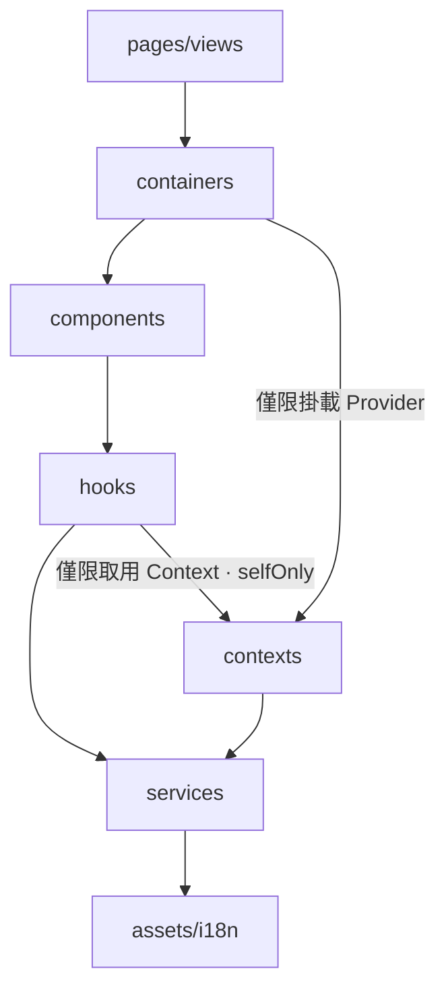

# 分層架構

> **與 blueprint 的關係**：這一頁講的分層，就是 blueprint config 裡的 `architecture` 區塊 ——<br>
> 也是整套工程理念裡，唯一會被編成**硬性護欄**的部分：[生成的 ESLint config](/zh-TW/guide/generated-artifacts#eslint-config-mjs-——-強制) 與 [inspect 檢測](/zh-TW/guide/reference#inspect-回報的檢測項目)。<br>
> 你只要在 [`blueprint.config.mjs`](/zh-TW/guide/getting-started#blueprint-config) 把自己的分層宣告出來，這套機制就照著幫你把關。

**核心只有一句：程式碼只能往下流。**<br>
把專案切成有順序的幾層，每一層只能 import 它下面的層、不能反過來 —— 而且每層只做一件事。

這套規則跟你用什麼框架無關，Vue、React 都通 —— 差別只在名字：<br>
Vue 的 composable 就是 React 的 hook，其餘一一對應：<br>
`composable ↔ hook`、`context ↔ Context`、`SFC ↔ function component`、`service ↔ api client`。

下面就是那個順序，箭頭是「可以 import 的方向」：



## 單向依賴流的理由

1. 每層只做一件事（hook 不匯入 component，所以它一直是可重用的邏輯單元）
2. 資料歸屬一眼就看得出來，不用搜遍整個專案
3. 重構起來安全：跨層搬檔案時，lint 會一次把所有非法呼叫點列出來
4. 多加一條依賴邊，就等於改了 blueprint config —— 逼你在 review 時正面回答「這一層真的該依賴那一層嗎」

## 各層職責

**`pages`**
- 職責 — 頁面版型與 containers 的組裝；對應路由與 SEO
- 禁止 — 放置商業邏輯、直接堆疊 components

**`containers`**
- 職責 — 單一功能的組裝、商業邏輯與資料增刪查改；持有狀態、呼叫 service、驅動導覽

**`components`**
- 職責 — 可重用的介面元件，以呈現為主，可呼叫 hook
- 禁止 — 操作路由、直接呼叫 service、持有應用程式狀態

**`hooks`**
- 職責 — `inject` / `useContext` 只在此層；加工伺服器資料與共享狀態；**狀態儲存庫（Pinia / Zustand）為本層私有物件**
- 禁止 — 對外暴露原始的狀態儲存庫

**`contexts`**
- 職責 — `provide` / `createContext` 只在此層；對外提供 Context 與 Provider

**`services`**
- 職責 — 網路存取原語；唯一可匯入 `axios`、唯一可呼叫 `fetch` / `WebSocket` 之處
- 禁止 — 夾帶介面或商業邏輯（只回傳資料）

**這套架構不設 `stores`、也不設 `utils` 這兩層。**<br>
每個狀態儲存庫都該有一個唯一擁有它的 hook 模組，這個 hook 就是它對外的介面；其他功能一律透過它讀取。<br>
至於 `utils/`，它就是個沒有內聚性的雜物間：<br>
任何「看起來很通用」的東西都會被丟進去、越長越大，最後變成所有模組都依賴的耦合點。<br>
純函式該照「誰在用」來歸屬：<br>
只有單一模組在用，就當那個模組的私有檔案；<br>
跨模組要共用，就開一個有名字、依領域切分的獨立模組，讓它「掙到一個名字」。

## 所有權 —— `owns`

上表那句「唯一可匯入 `axios`」不是講好看的 —— 它會被編成規則。<br>
一層宣告了它獨佔哪些原語，其他層就一律不准碰：

```js
{ name: 'services', owns: ['axios', { global: 'fetch' }, { global: 'WebSocket' }] },
{ name: 'hooks',    owns: [{ package: 'vue', imports: ['inject'] }, 'pinia'] },
```

- 純字串代表持有**整個套件**；<br>
  `{ package, imports }` 可以收窄到特定的具名匯入（`vue` 各層還是能匯入 —— 只有 `inject` 被擋）
- `{ global }` 代表持有**全域物件**（`fetch`、`WebSocket`）——<br>
  全域物件沒有 import 敘述，所以這半邊是 lint（`no-restricted-globals`）在管、不是 `inspect`
- 套件所有權有兩道防線：<br>
  lint（`no-restricted-imports`）跟 inspect 的 [`package-ownership` 檢測](/zh-TW/guide/reference#inspect-回報的檢測項目)

## 功能資料夾 —— 模組的組成方式

```
components/
└─ Dropdown/
   ├─ index        ← 對外唯一入口（公開）
   ├─ Dropdown     ← 實作本體，檔名即模組名（不命名為 Component）
   ├─ hooks        ← 私有
   ├─ styles       ← 私有
   └─ types        ← 私有
```

- `index` 是模組對外的**門面**，外面只認得這個入口
- 私有子元件就放在模組裡（例如 container 底下的 `ProfileTab`）——<br>
  「先私有，真的需要共享再上提」是自然的成長路徑，不用一開始就預測
- 實作檔用「模組名」命名：<br>
  要是全都叫 `Component.tsx`，編輯器的分頁跟快速開啟根本認不出誰是誰

`components` 跟 `containers` 怎麼分，一句話：**「換一個功能場景，它還能用嗎？」**<br>
能，就是 components（可重用、不綁資料）；<br>
綁了特定功能的資料、流程或增刪查改，就是 containers。<br>
**containers 負責把 components 跟資料接起來；components 完全不知道 containers 的存在。**
